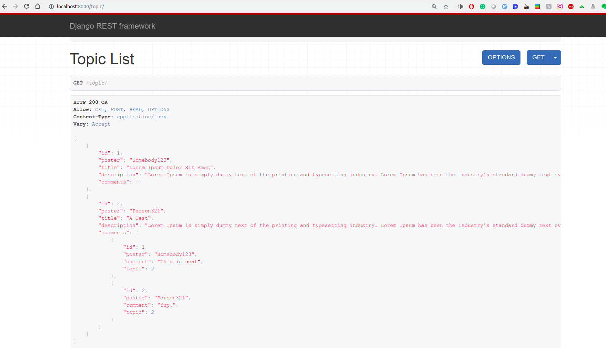
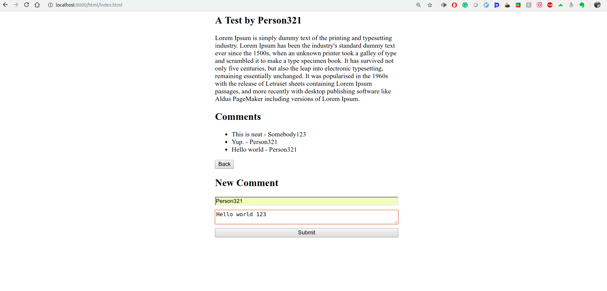
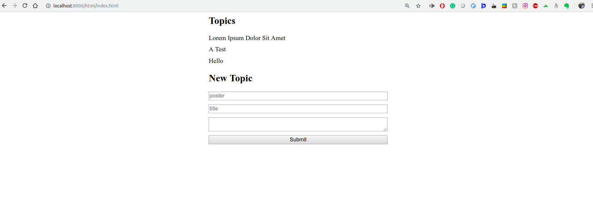

# ~2 hour technical test

Interesting bits are:

- [https://github.com/MatthewVi/CSTechnicalTest/blob/master/main/models.py](https://github.com/MatthewVi/CSTechnicalTest/blob/master/main/models.py)
- [https://github.com/MatthewVi/CSTechnicalTest/blob/master/main/serializers.py](https://github.com/MatthewVi/CSTechnicalTest/blob/master/main/serializers.py)

(Excuse the quick and dirty jQuery frontend)

```
virtualenv env
source env/bin/activate
pip install -r requirements.txt
python manage.py migrate
python manage.py runserver
```




